# Parlay Golf Ventures Site Structure Map

```mermaid
graph TD
    A[Parlay Golf Ventures] --> B[Public Area]
    A --> C[Member Area]
    A --> D[Admin Area]
    
    %% Public Area
    B --> B1[Home Page]
    B --> B2[Academy]
    B --> B3[Tournament]
    B --> B4[News]
    B --> B5[Contribute]
    B --> B6[Login/Signup]
    B --> B7[Join Free]
    
    %% Academy Section
    B2 --> B2a[Short Game Secrets]
    B2 --> B2b[Academy Dashboard]
    B2 --> B2c[Schedule Review]
    
    %% Member Area
    C --> C1[Dashboard]
    C --> C2[Profile]
    C --> C3[Membership]
    C --> C4[Community]
    C --> C5[Billing]
    C --> C6[Search]
    
    %% Contribution Section
    B5 --> B5a[Contribution Landing]
    B5 --> B5b[Member Contribution]
    B5 --> B5c[Guest Contribution]
    B5 --> B5d[Mentor Contribution]
    B5 --> B5e[Content Creator]
    B5 --> B5f[Community Hub]
    
    %% Admin Area
    D --> D1[Admin Dashboard]
    D --> D2[User Management]
    D --> D3[Content Management]
    D --> D4[Communications]
    D --> D5[Tournaments]
    D --> D6[Analytics]
    D --> D7[Settings]
    D --> D8[Beta Invites]
    
    %% Admin Dashboard Details
    D1 --> D1a[Overview Stats]
    D1 --> D1b[Recent Activity]
    D1 --> D1c[Quick Actions]
    D1 --> D1d[Notifications]
    
    %% Analytics Details
    D6 --> D6a[User Analytics]
    D6 --> D6b[Content Analytics]
    D6 --> D6c[Engagement Metrics]
    D6 --> D6d[Revenue Reports]
    
    %% Settings Details
    D7 --> D7a[Profile Settings]
    D7 --> D7b[Security Settings]
    D7 --> D7c[Notification Settings]
    D7 --> D7d[Appearance Settings]
    D7 --> D7e[General Settings]
    
    classDef publicNode fill:#d4f1f9,stroke:#05386B,stroke-width:1px;
    classDef memberNode fill:#c5e8b7,stroke:#05386B,stroke-width:1px;
    classDef adminNode fill:#ffcccc,stroke:#05386B,stroke-width:1px;
    classDef highlightNode fill:#ffe066,stroke:#05386B,stroke-width:2px;
    
    class A,B,B1,B2,B3,B4,B5,B6,B7,B2a,B2b,B2c,B5a,B5b,B5c,B5d,B5e,B5f publicNode;
    class C,C1,C2,C3,C4,C5,C6 memberNode;
    class D,D1,D2,D3,D4,D5,D6,D7,D8,D1a,D1b,D1c,D1d,D6a,D6b,D6c,D6d,D7a,D7b,D7c,D7d,D7e adminNode;
    class D1,D6,D7 highlightNode;
```

## Legend

- **Blue Nodes**: Public Area - Accessible to all users
- **Green Nodes**: Member Area - Requires login
- **Red Nodes**: Admin Area - Requires admin privileges
- **Yellow Highlight**: Recently enhanced components
