# Parlay Golf Ventures Technical Architecture Map

```mermaid
graph TD
    Client[Client Browser] --> FE[Frontend React App]
    FE --> Router[React Router]
    
    %% Frontend Components
    Router --> PublicComponents[Public Components]
    Router --> MemberComponents[Member Components]
    Router --> AdminComponents[Admin Components]
    Router --> SharedComponents[Shared UI Components]
    
    %% Admin Components Detail
    AdminComponents --> AdminDashboard[Admin Dashboard]
    AdminComponents --> AnalyticsTab[Analytics Tab]
    AdminComponents --> SettingsTab[Settings Tab]
    
    %% Data Flow
    FE --> API[API Layer]
    API --> Supabase[Supabase Backend]
    
    %% Server-Side Rendering
    Client --> SSR[Server-Side Rendering]
    SSR --> Express[Express Server]
    Express --> Vite[Vite Dev Server]
    Express --> StaticAssets[Static Assets]
    Express --> ServerEntry[Server Entry Point]
    ServerEntry --> App[App Component]
    
    %% Performance Optimizations
    FE --> LazyLoading[Lazy Loading]
    FE --> CodeSplitting[Code Splitting]
    FE --> Suspense[React Suspense]
    
    %% Error Handling
    FE --> ErrorHandling[Error Handling]
    ErrorHandling --> Monitoring[Error Monitoring]
    ErrorHandling --> Fallbacks[Fallback Components]
    
    %% Data Management
    FE --> ReactQuery[React Query]
    ReactQuery --> CacheManagement[Cache Management]
    
    %% Authentication
    FE --> Auth[Authentication]
    Auth --> ProtectedRoutes[Protected Routes]
    Auth --> RoleBasedAccess[Role-Based Access]
    
    classDef clientNode fill:#d4f1f9,stroke:#05386B,stroke-width:1px;
    classDef serverNode fill:#c5e8b7,stroke:#05386B,stroke-width:1px;
    classDef dataNode fill:#ffcccc,stroke:#05386B,stroke-width:1px;
    classDef optimizationNode fill:#ffe066,stroke:#05386B,stroke-width:1px;
    
    class Client,FE,Router,PublicComponents,MemberComponents,AdminComponents,SharedComponents,AdminDashboard,AnalyticsTab,SettingsTab clientNode;
    class SSR,Express,Vite,StaticAssets,ServerEntry,App serverNode;
    class API,Supabase,ReactQuery,CacheManagement,Auth,ProtectedRoutes,RoleBasedAccess dataNode;
    class LazyLoading,CodeSplitting,Suspense,ErrorHandling,Monitoring,Fallbacks optimizationNode;
```

## Legend

- **Blue Nodes**: Client-Side Components - Browser and React components
- **Green Nodes**: Server-Side Components - Express server and SSR infrastructure
- **Red Nodes**: Data Management - API, database, and state management
- **Yellow Nodes**: Performance Optimizations - Techniques to improve application performance
