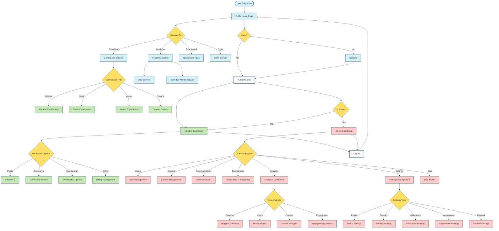

# Parlay Golf Ventures User Experience Flow Map

## Legend

- **Blue Nodes**: Public Flow - Actions available to all users
- **Green Nodes**: Member Flow - Actions requiring member login
- **Red Nodes**: Admin Flow - Actions requiring admin privileges
- **Yellow Nodes**: Decision Points - User choices that determine flow direction
- **Gray Nodes**: Entry/Exit Points - Start and end of user journeys
