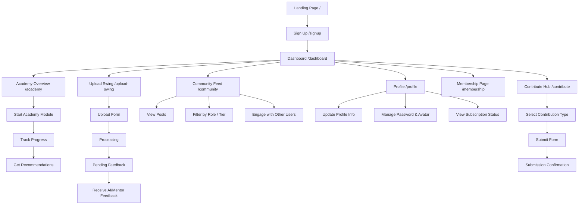

# Parlay Golf Ventures - User Flow Diagram

## Overview

This diagram illustrates the primary user flows within the Parlay Golf Ventures platform. It shows the main navigation paths and key interaction points for users.

## Key User Journeys

### New User Onboarding
- Landing Page → Sign Up → Dashboard

### Learning Journey
- Dashboard → Academy Overview → Start Module → Track Progress → Get Recommendations

### Skill Improvement
- Dashboard → Upload Swing → Upload Form → Processing → Pending Feedback → Receive AI/Mentor Feedback

### Community Engagement
- Dashboard → Community Feed → View Posts/Filter/Engage

### Profile Management
- Dashboard → Profile → Update Info/Manage Password/View Subscription

### Content Contribution
- Dashboard → Contribute Hub → Select Type → Submit Form → Confirmation

## Route Structure

The diagram maps to the following routes in the application:

| User Flow Node | Route Path |
|----------------|------------|
| Landing Page | `/` |
| Sign Up | `/signup` |
| Dashboard | `/dashboard` |
| Academy Overview | `/academy` |
| Upload Swing | `/upload-swing` |
| Community Feed | `/community` |
| Profile | `/profile` |
| Membership Page | `/membership` |
| Contribute Hub | `/contribute` |

## Implementation Status

Some routes are currently redirecting to the Coming Soon page during development:

- `/upload-swing` → `/coming-soon`
- `/contribute` → `/coming-soon`

The core navigation structure is implemented, with feature-specific flows being developed incrementally.
